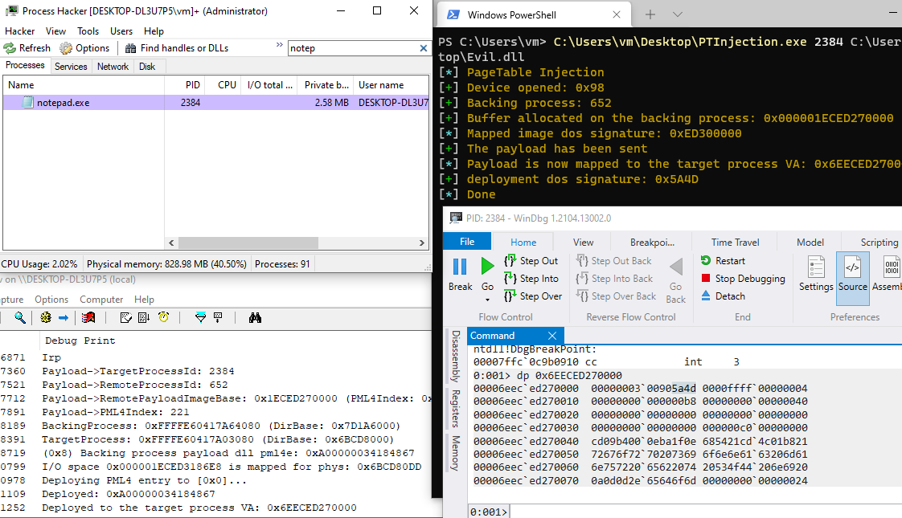
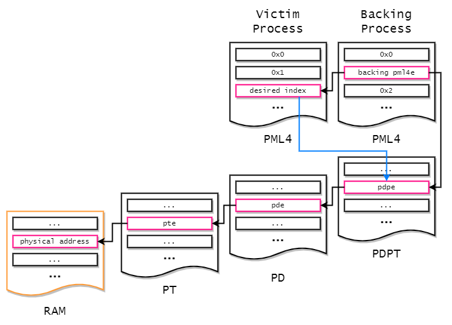

<p align="center">

</p>

<p align="center">


</p>

# PageTableInjection

Code Injection, Inject malicious payload via pagetables pml4.

# Introduction

This is just a proof-of-concept of the page table injection technique to inject malicious code into the arbitrary user processes.  
On Windows(and some modern OSes), every process has a its PML4 a.k.a *Directory Table Base*. Thus the process *A* cannot access process *B* without APIs. but how about if we can inject arbitrary PML4 entry? of course the PML4 entry will points to the corresponding physical address of entries, `PDP`, `PD` and `PT` as exact same as the backing process.  

In order to inject malicious PML4 entry to the target process, we need to have an *actual* resident page (physical memory) that backing the malicious PML4 entry. Thus literally the resident page must be a resident, otherwise the system will crash or would become unstable, because during the MMU translates to the physical address, there is nothing that MMU expects.

Let's look at the both backing process and target process buffers. In this case, the buffers are:

- Backing Process VA: `0x1A45F810000`
- Deployment Process Injected VA: `0x6EA45F810000`

Before step to the next, some of you may think that the 2nd address(`0x6EA45F810000`) looks weird, like usually we allocated buffer via `malloc` or `VirtualAlloc`, the virtual address should look like `0x17C7CAC0000` `0x23BE9D80000` `0x19FE76F0000`. it's because the PML4 entry is not involved to the memory manager of windows, and is not managed aswell. of course every virtual address on Windows 64-bit process could possibly have *any* value within a range of user memory range.

So if we look into the both address...

```
0: kd> .process ffff9803d8037080
Implicit process is now ffff9803`d8037080
0: kd> db 0x6EA45F810000 l2
00006ea4`5f810000  4d 5a       MZ

0: kd> !vtop 7968b000 0x6EA45F810000
Amd64VtoP: Virt 00006ea45f810000, pagedir 000000007968b000
Amd64VtoP: PML4E 000000007968b6e8
Amd64VtoP: PDPE 000000005849b488
Amd64VtoP: PDE 0000000059e9c7e0
Amd64VtoP: PTE 000000003251d080
Amd64VtoP: Mapped phys 0000000014306000
Virtual address 6ea45f810000 translates to physical address 14306000.
```

```
0: kd> .process ffff9803d9f6b080
Implicit process is now ffff9803`d9f6b080
0: kd> db 0x1A45F810000 l2
000001a4`5f810000  4d 5a       MZ

0: kd> !vtop 564f6000 0x1A45F810000
Amd64VtoP: Virt 000001a45f810000, pagedir 00000000564f6000
Amd64VtoP: PML4E 00000000564f6018
Amd64VtoP: PDPE 000000005849b488
Amd64VtoP: PDE 0000000059e9c7e0
Amd64VtoP: PTE 000000003251d080
Amd64VtoP: Mapped phys 0000000014306000
Virtual address 1a45f810000 translates to physical address 14306000.
```

Both of addresses are corresponding to the exact same page table entries, `PDP`, `PD`, `PT` and an physical address. Therefore if we modified backing process's buffer, the change also on the target process. This is very similar to the shared-memory on the Windows, but the diffence is that memory region on the target process will never be shown in any VAD entries of its process. but in other hand, if the backing process's buffer is freed, it means also on the target process but without touching target process's page table entries, which means that the memory manager will cause a bugcheck `MEMORY_MANAGEMENT`, or worse triple fault.

<p align="center">

</p>